---
output:
  pdf_document: default
  html_document: default
---
# Análisis preliminar

A continuación realizamos un análisis preliminar del dataset de precios de pañales obtenido. Dividiremos el análisis en las siguientes fases:

- Descripción de atributos
- Consumo de Pañales VS Canásta Básica (Indec)
- Presupuesto destinado a pañales en los primeros *n* meses de vida del bebe


```python
import pandas as pd
from matplotlib import pyplot as plt
import seaborn as sns

sns.set(style="darkgrid")
def prepare_df():
    df = pd.read_csv('diapers.csv')
    # filter items that are wrongly calculated
    return df[df['unit_price'] < 200]

df = prepare_df()
df
```


<div>
<style scoped>
    .dataframe tbody tr th:only-of-type {
        vertical-align: middle;
    }

    .dataframe tbody tr th {
        vertical-align: top;
    }

    .dataframe thead th {
        text-align: right;
    }
</style>
<table border="1" class="dataframe">
  <thead>
    <tr style="text-align: right;">
      <th></th>
      <th>price</th>
      <th>website</th>
      <th>brand</th>
      <th>size</th>
      <th>target_kg_min</th>
      <th>target_kg_max</th>
      <th>units</th>
      <th>unit_price</th>
    </tr>
  </thead>
  <tbody>
    <tr>
      <th>0</th>
      <td>999.99</td>
      <td>www.perfumeriasmiriam.com.ar</td>
      <td>babysec</td>
      <td>g</td>
      <td>8.5</td>
      <td>12.0</td>
      <td>36</td>
      <td>27.78</td>
    </tr>
    <tr>
      <th>1</th>
      <td>999.99</td>
      <td>www.perfumeriasmiriam.com.ar</td>
      <td>babysec</td>
      <td>m</td>
      <td>5.0</td>
      <td>9.5</td>
      <td>44</td>
      <td>22.73</td>
    </tr>
    <tr>
      <th>2</th>
      <td>999.99</td>
      <td>www.perfumeriasmiriam.com.ar</td>
      <td>babysec</td>
      <td>xxg</td>
      <td>13.0</td>
      <td>20.0</td>
      <td>26</td>
      <td>38.46</td>
    </tr>
    <tr>
      <th>3</th>
      <td>999.99</td>
      <td>www.perfumeriasmiriam.com.ar</td>
      <td>babysec</td>
      <td>xg</td>
      <td>11.0</td>
      <td>15.0</td>
      <td>28</td>
      <td>35.71</td>
    </tr>
    <tr>
      <th>4</th>
      <td>1000.00</td>
      <td>www.perfumeriasmiriam.com.ar</td>
      <td>pampers</td>
      <td>p</td>
      <td>5.0</td>
      <td>7.5</td>
      <td>36</td>
      <td>27.78</td>
    </tr>
    <tr>
      <th>...</th>
      <td>...</td>
      <td>...</td>
      <td>...</td>
      <td>...</td>
      <td>...</td>
      <td>...</td>
      <td>...</td>
      <td>...</td>
    </tr>
    <tr>
      <th>5345</th>
      <td>2230.53</td>
      <td>www.anaperfumeriaonline.com.ar</td>
      <td>pampers</td>
      <td>g</td>
      <td>9.0</td>
      <td>12.0</td>
      <td>68</td>
      <td>32.80</td>
    </tr>
    <tr>
      <th>5346</th>
      <td>4610.42</td>
      <td>www.anaperfumeriaonline.com.ar</td>
      <td>pampers</td>
      <td>xxg</td>
      <td>14.0</td>
      <td>20.0</td>
      <td>88</td>
      <td>52.39</td>
    </tr>
    <tr>
      <th>5347</th>
      <td>4610.42</td>
      <td>www.anaperfumeriaonline.com.ar</td>
      <td>pampers</td>
      <td>xg</td>
      <td>12.0</td>
      <td>15.0</td>
      <td>96</td>
      <td>48.03</td>
    </tr>
    <tr>
      <th>5348</th>
      <td>4610.42</td>
      <td>www.anaperfumeriaonline.com.ar</td>
      <td>pampers</td>
      <td>g</td>
      <td>9.0</td>
      <td>12.0</td>
      <td>110</td>
      <td>41.91</td>
    </tr>
    <tr>
      <th>5349</th>
      <td>557.79</td>
      <td>www.anaperfumeriaonline.com.ar</td>
      <td>pampers</td>
      <td>m</td>
      <td>6.0</td>
      <td>9.5</td>
      <td>18</td>
      <td>30.99</td>
    </tr>
  </tbody>
</table>
<p>5335 rows × 8 columns</p>
</div>


## Descripción de atributos

Observamos los atributos recabados:

- **price**. Precio por paquete (antes precio).
- **website**. Identificar el vendedor.
- **brand**. Identificar la marca. Extraer atributo de description.
- **size**. Talle del pañal. Extraer atributo de description.
- **target_kg(\_min|\_max)**. Tamaño mínimo y máximo en KGs soportado. Clasificar atributo en base a tabla.
- **units**. Unidades por paquete. Extraer atributo de description.
- **unit_price**. Precio unitario. Calcular a partir de price/units.


```python
df.head()
```


<div>
<style scoped>
    .dataframe tbody tr th:only-of-type {
        vertical-align: middle;
    }

    .dataframe tbody tr th {
        vertical-align: top;
    }

    .dataframe thead th {
        text-align: right;
    }
</style>
<table border="1" class="dataframe">
  <thead>
    <tr style="text-align: right;">
      <th></th>
      <th>price</th>
      <th>website</th>
      <th>brand</th>
      <th>size</th>
      <th>target_kg_min</th>
      <th>target_kg_max</th>
      <th>units</th>
      <th>unit_price</th>
    </tr>
  </thead>
  <tbody>
    <tr>
      <th>0</th>
      <td>999.99</td>
      <td>www.perfumeriasmiriam.com.ar</td>
      <td>babysec</td>
      <td>g</td>
      <td>8.5</td>
      <td>12.0</td>
      <td>36</td>
      <td>27.78</td>
    </tr>
    <tr>
      <th>1</th>
      <td>999.99</td>
      <td>www.perfumeriasmiriam.com.ar</td>
      <td>babysec</td>
      <td>m</td>
      <td>5.0</td>
      <td>9.5</td>
      <td>44</td>
      <td>22.73</td>
    </tr>
    <tr>
      <th>2</th>
      <td>999.99</td>
      <td>www.perfumeriasmiriam.com.ar</td>
      <td>babysec</td>
      <td>xxg</td>
      <td>13.0</td>
      <td>20.0</td>
      <td>26</td>
      <td>38.46</td>
    </tr>
    <tr>
      <th>3</th>
      <td>999.99</td>
      <td>www.perfumeriasmiriam.com.ar</td>
      <td>babysec</td>
      <td>xg</td>
      <td>11.0</td>
      <td>15.0</td>
      <td>28</td>
      <td>35.71</td>
    </tr>
    <tr>
      <th>4</th>
      <td>1000.00</td>
      <td>www.perfumeriasmiriam.com.ar</td>
      <td>pampers</td>
      <td>p</td>
      <td>5.0</td>
      <td>7.5</td>
      <td>36</td>
      <td>27.78</td>
    </tr>
  </tbody>
</table>
</div>


```python
def add_values(ax, feature):
    total = len(feature)
    for p in ax.patches:
        percentage = '{:.1f}%'.format(100 * p.get_height()/total)
        x = p.get_x() + p.get_width() / 2 - 0.2
        y = p.get_y() + p.get_height()
        ax.annotate(percentage, (x, y), size = 12)

ax = sns.countplot(y="website", data=df, orient="h")
```


    
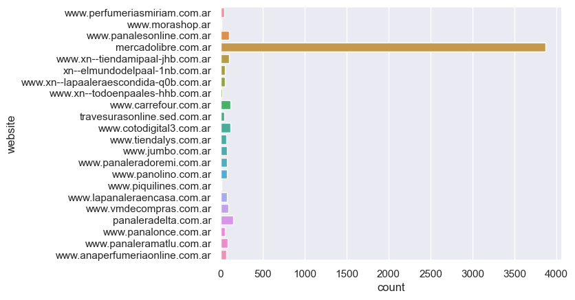
    


### Distribución items websites (sin Mercadolibre)

Observamos la distribución de los websites quitando Mercadolibre


```python
e = df[df['website'] != 'mercadolibre.com.ar']
ax = sns.countplot(y="website", data=e, orient="h")
```


    
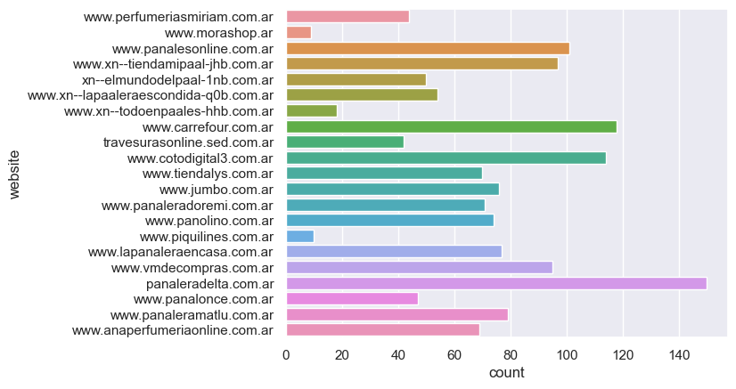
    


```python
ax = sns.countplot(x="brand", data=df)
add_values(ax, df)
```


    
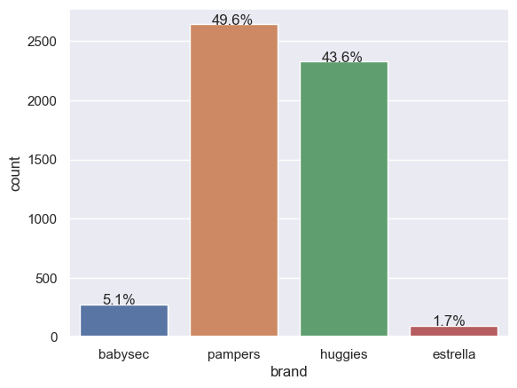
    


```python
ax = sns.countplot(x="size", data=df)
add_values(ax, df)
```


    
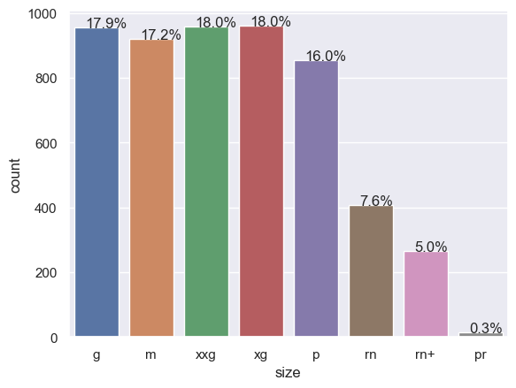
    


Observamos que a mayor talle mayor precio unitario


```python
order_sizes = ["pr", "rn", "rn+", "p", "m", "g", "xg", "xxg"]
sns.barplot(data=df, x="brand", y="unit_price", hue="size", hue_order=order_sizes)
```


    <AxesSubplot: xlabel='brand', ylabel='unit_price'>


    
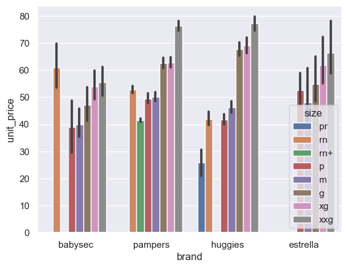
    


```python
ax = sns.barplot(data=df, x="brand", y="unit_price")
```


    
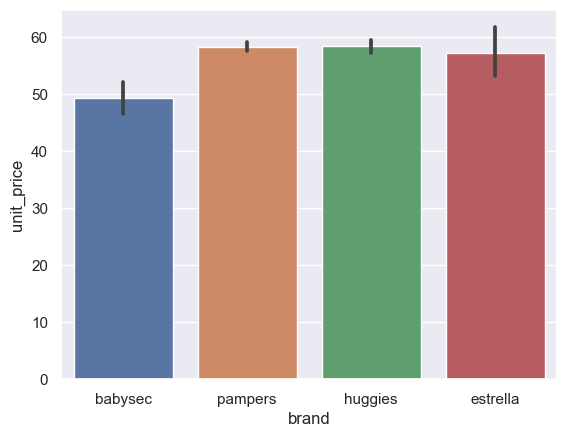
    


### Distribuciones utilizadas

Utilizando una distribución normal con 1 unidad desvio standard. Utilizamos las siguientes configuraciones:

- Recién nacido hasta 2 meses - 7 pañales al dia
- De 3 a 8 meses - 6 pañales al dia
- De 9 a 24 meses - 5 pañales al dia


```python
import random
_rand = lambda x: int(random.normalvariate(x, 1))


def _get_random_daily_usage(month):
    if month < 3:
        return _rand(7)
    if month < 9:
        return _rand(6)
    return _rand(5)

plt.hist([_get_random_daily_usage(1) for _ in range(1_000_000)], bins=100)
plt.show()
```


    
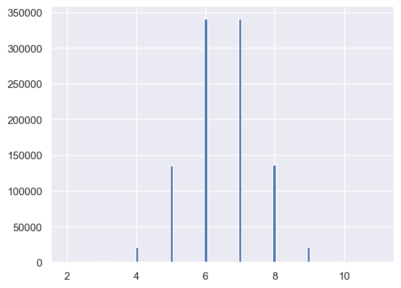
    


```python

```

## Consumo de pañales VS canasta básica

A continuación comparamos el consumo de pañales mensual vs la canasta básica.


```python
cb = pd.read_excel('serie_cba_cbt.xls')
canasta_basica_indigencia = cb.loc[83][1]
canasta_basica = cb.loc[83][3]
```


```python
# Los primeros 6 Meses de vida, 6 y 12 pañales

def _cal_canasta(month):
    avg_daily_usage = _get_random_daily_usage(month) 
    avg_monthly_usage = 30 * avg_daily_usage
    canasta_basica = cb.loc[83][3]

    avg_cost_diapers = df['unit_price'].mean()  * avg_monthly_usage
    print(f"Bebe de {month} mes/es")
    print(f"Consumo promedio diario: {avg_monthly_usage}")
    print(f"Costo promedio mensual en pañales: {avg_cost_diapers}")
    print(f"Canasta básica mensual - Septiembre 2022: {canasta_basica}")
    print(f"% de canasta basica: {avg_cost_diapers / canasta_basica}")
    print("\n")
    
_cal_canasta(1)
_cal_canasta(6)
_cal_canasta(12)
```

    Bebe de 1 mes/es
    Consumo promedio diario: 180
    Costo promedio mensual en pañales: 10405.506466729146
    Canasta básica mensual - Septiembre 2022: 41493.24
    % de canasta basica: 0.2507759448702764
    
    
    Bebe de 6 mes/es
    Consumo promedio diario: 150
    Costo promedio mensual en pañales: 8671.255388940956
    Canasta básica mensual - Septiembre 2022: 41493.24
    % de canasta basica: 0.20897995405856365
    
    
    Bebe de 12 mes/es
    Consumo promedio diario: 150
    Costo promedio mensual en pañales: 8671.255388940956
    Canasta básica mensual - Septiembre 2022: 41493.24
    % de canasta basica: 0.20897995405856365
    
    


### TO-DO:
- Agregar una serie de consumo promedio mensual o diario. Evitar funcion random creada.

## Presupuesto destinado a pañales en los primeros n meses de vida del bebe

A continuación evaluamos diferentes presupuestos destinados a gastar en pañales para los primeros 32 meses de vida del bebe. Calculamos utilizando los percentiles de crecimiento de la OMS para niños y niñas.


```python
bp = pd.read_csv('tab_wfa_boys_p_0_5.csv')
gp = pd.read_csv('tab_wfa_girls_p_0_5.csv')
bp.head()
```


<div>
<style scoped>
    .dataframe tbody tr th:only-of-type {
        vertical-align: middle;
    }

    .dataframe tbody tr th {
        vertical-align: top;
    }

    .dataframe thead th {
        text-align: right;
    }
</style>
<table border="1" class="dataframe">
  <thead>
    <tr style="text-align: right;">
      <th></th>
      <th>Month</th>
      <th>L</th>
      <th>M</th>
      <th>S</th>
      <th>P01</th>
      <th>P1</th>
      <th>P3</th>
      <th>P5</th>
      <th>P10</th>
      <th>P15</th>
      <th>P25</th>
      <th>P50</th>
      <th>P75</th>
      <th>P85</th>
      <th>P90</th>
      <th>P95</th>
      <th>P97</th>
      <th>P99</th>
      <th>P999</th>
    </tr>
  </thead>
  <tbody>
    <tr>
      <th>0</th>
      <td>0</td>
      <td>0.3487</td>
      <td>3.3464</td>
      <td>0.14602</td>
      <td>2.0</td>
      <td>2.3</td>
      <td>2.5</td>
      <td>2.6</td>
      <td>2.8</td>
      <td>2.9</td>
      <td>3.0</td>
      <td>3.3</td>
      <td>3.7</td>
      <td>3.9</td>
      <td>4.0</td>
      <td>4.2</td>
      <td>4.3</td>
      <td>4.6</td>
      <td>5.1</td>
    </tr>
    <tr>
      <th>1</th>
      <td>1</td>
      <td>0.2297</td>
      <td>4.4709</td>
      <td>0.13395</td>
      <td>2.9</td>
      <td>3.2</td>
      <td>3.4</td>
      <td>3.6</td>
      <td>3.8</td>
      <td>3.9</td>
      <td>4.1</td>
      <td>4.5</td>
      <td>4.9</td>
      <td>5.1</td>
      <td>5.3</td>
      <td>5.5</td>
      <td>5.7</td>
      <td>6.0</td>
      <td>6.6</td>
    </tr>
    <tr>
      <th>2</th>
      <td>2</td>
      <td>0.1970</td>
      <td>5.5675</td>
      <td>0.12385</td>
      <td>3.7</td>
      <td>4.1</td>
      <td>4.4</td>
      <td>4.5</td>
      <td>4.7</td>
      <td>4.9</td>
      <td>5.1</td>
      <td>5.6</td>
      <td>6.0</td>
      <td>6.3</td>
      <td>6.5</td>
      <td>6.8</td>
      <td>7.0</td>
      <td>7.4</td>
      <td>8.1</td>
    </tr>
    <tr>
      <th>3</th>
      <td>3</td>
      <td>0.1738</td>
      <td>6.3762</td>
      <td>0.11727</td>
      <td>4.4</td>
      <td>4.8</td>
      <td>5.1</td>
      <td>5.2</td>
      <td>5.5</td>
      <td>5.6</td>
      <td>5.9</td>
      <td>6.4</td>
      <td>6.9</td>
      <td>7.2</td>
      <td>7.4</td>
      <td>7.7</td>
      <td>7.9</td>
      <td>8.3</td>
      <td>9.1</td>
    </tr>
    <tr>
      <th>4</th>
      <td>4</td>
      <td>0.1553</td>
      <td>7.0023</td>
      <td>0.11316</td>
      <td>4.9</td>
      <td>5.4</td>
      <td>5.6</td>
      <td>5.8</td>
      <td>6.0</td>
      <td>6.2</td>
      <td>6.5</td>
      <td>7.0</td>
      <td>7.6</td>
      <td>7.9</td>
      <td>8.1</td>
      <td>8.4</td>
      <td>8.6</td>
      <td>9.1</td>
      <td>9.8</td>
    </tr>
  </tbody>
</table>
</div>


### Consumo mensual de pañales

Aplicamos a los percenitles de crecimiento la siguiente función que convierte el peso para ese percentil en cantidad de dinero promedio a gastar en base a los items que aplican para ese determinado percentil.

Ejemplo: Para el percentil P01 (*P*) en el mes 0 (*m*) tenemos que el bebe pesará 2.0kg (*K<sub>mp</sub>*), entonces buscamos los items en los que *target_kg_min <= K<sub>mp</sub> <= target_kg_max* y calculamos un promedio de todos. 


```python
def _filter_series(target_kg, month):
    # Calculamos el costo mensual promedio para el percentil en base a *target_kg*
    # Utilizando un consumo mensual fijo de pañales

    _df = df[df['target_kg_min'] <= target_kg]
    _df[target_kg <= _df['target_kg_max']]
    return _df['unit_price'].mean() * _get_random_daily_usage(month) * 30

def _filter_d(target_kg):
    return pd.Series([_filter_series(e, i) for i, e in enumerate(target_kg)])
```

#### En Niños


```python
keys = [ 'P01', 'P1', 'P3', 'P5', 'P10', 'P15', 'P25', 'P50', 'P75', 'P85', 'P90', 'P95', 'P97', 'P99','P999']

nbp = bp[keys]
nbp = nbp.apply(_filter_d)
nbp.describe()
```


<div>
<style scoped>
    .dataframe tbody tr th:only-of-type {
        vertical-align: middle;
    }

    .dataframe tbody tr th {
        vertical-align: top;
    }

    .dataframe thead th {
        text-align: right;
    }
</style>
<table border="1" class="dataframe">
  <thead>
    <tr style="text-align: right;">
      <th></th>
      <th>P01</th>
      <th>P1</th>
      <th>P3</th>
      <th>P5</th>
      <th>P10</th>
      <th>P15</th>
      <th>P25</th>
      <th>P50</th>
      <th>P75</th>
      <th>P85</th>
      <th>P90</th>
      <th>P95</th>
      <th>P97</th>
      <th>P99</th>
      <th>P999</th>
    </tr>
  </thead>
  <tbody>
    <tr>
      <th>count</th>
      <td>33.000000</td>
      <td>33.000000</td>
      <td>33.000000</td>
      <td>33.000000</td>
      <td>33.000000</td>
      <td>33.000000</td>
      <td>33.000000</td>
      <td>33.000000</td>
      <td>33.000000</td>
      <td>33.000000</td>
      <td>33.000000</td>
      <td>33.000000</td>
      <td>33.000000</td>
      <td>33.000000</td>
      <td>33.000000</td>
    </tr>
    <tr>
      <th>mean</th>
      <td>6178.014816</td>
      <td>6960.683450</td>
      <td>6999.539405</td>
      <td>6650.105474</td>
      <td>7782.385617</td>
      <td>7268.743311</td>
      <td>7279.457397</td>
      <td>7704.717482</td>
      <td>7245.891295</td>
      <td>7391.635982</td>
      <td>7646.187084</td>
      <td>7606.424599</td>
      <td>7516.025418</td>
      <td>7601.732060</td>
      <td>8176.590554</td>
    </tr>
    <tr>
      <th>std</th>
      <td>1676.850010</td>
      <td>1930.305967</td>
      <td>1742.766060</td>
      <td>1339.608590</td>
      <td>1317.309776</td>
      <td>1792.892398</td>
      <td>1761.941151</td>
      <td>1565.425599</td>
      <td>1409.166941</td>
      <td>1740.425950</td>
      <td>1616.561115</td>
      <td>1678.527337</td>
      <td>1960.957164</td>
      <td>1973.178162</td>
      <td>1533.233906</td>
    </tr>
    <tr>
      <th>min</th>
      <td>3058.472424</td>
      <td>4140.795043</td>
      <td>3058.472424</td>
      <td>4587.708636</td>
      <td>5521.060057</td>
      <td>4140.795043</td>
      <td>4587.708636</td>
      <td>4587.708636</td>
      <td>3468.502156</td>
      <td>3241.099497</td>
      <td>4861.649246</td>
      <td>3242.482782</td>
      <td>4587.708636</td>
      <td>1734.251078</td>
      <td>4863.724173</td>
    </tr>
    <tr>
      <th>25%</th>
      <td>5193.575575</td>
      <td>5521.060057</td>
      <td>5521.060057</td>
      <td>5524.365066</td>
      <td>6901.325071</td>
      <td>6116.944848</td>
      <td>6116.944848</td>
      <td>6484.965564</td>
      <td>6123.793915</td>
      <td>6123.793915</td>
      <td>6484.965564</td>
      <td>6482.198995</td>
      <td>6116.944848</td>
      <td>6937.004311</td>
      <td>6937.004311</td>
    </tr>
    <tr>
      <th>50%</th>
      <td>5524.365066</td>
      <td>6905.456332</td>
      <td>6901.325071</td>
      <td>6766.346939</td>
      <td>7654.742394</td>
      <td>7646.181060</td>
      <td>7646.181060</td>
      <td>7958.904950</td>
      <td>7646.181060</td>
      <td>7646.181060</td>
      <td>7654.742394</td>
      <td>7654.742394</td>
      <td>7646.181060</td>
      <td>8102.748743</td>
      <td>8671.255389</td>
    </tr>
    <tr>
      <th>75%</th>
      <td>7646.181060</td>
      <td>8281.590085</td>
      <td>8281.590085</td>
      <td>7646.181060</td>
      <td>9088.757257</td>
      <td>8281.590085</td>
      <td>9088.757257</td>
      <td>9175.417272</td>
      <td>8106.206955</td>
      <td>8671.255389</td>
      <td>8671.255389</td>
      <td>8671.255389</td>
      <td>8671.255389</td>
      <td>8671.255389</td>
      <td>8671.255389</td>
    </tr>
    <tr>
      <th>max</th>
      <td>9621.558597</td>
      <td>10704.653484</td>
      <td>10704.653484</td>
      <td>9185.690873</td>
      <td>10704.653484</td>
      <td>10704.653484</td>
      <td>10716.639351</td>
      <td>9723.298492</td>
      <td>10387.151150</td>
      <td>10704.653484</td>
      <td>12139.757545</td>
      <td>10826.155102</td>
      <td>12139.757545</td>
      <td>11685.545044</td>
      <td>11343.848240</td>
    </tr>
  </tbody>
</table>
</div>


```python
keys = [ 'P01', 'P1', 'P3', 'P5', 'P10', 'P15', 'P25', 'P50', 'P75', 'P85', 'P90', 'P95', 'P97', 'P99','P999']

nbp = bp[keys]
nbp = nbp.apply(_filter_d)
nbp.describe()
```


<div>
<style scoped>
    .dataframe tbody tr th:only-of-type {
        vertical-align: middle;
    }

    .dataframe tbody tr th {
        vertical-align: top;
    }

    .dataframe thead th {
        text-align: right;
    }
</style>
<table border="1" class="dataframe">
  <thead>
    <tr style="text-align: right;">
      <th></th>
      <th>P01</th>
      <th>P1</th>
      <th>P3</th>
      <th>P5</th>
      <th>P10</th>
      <th>P15</th>
      <th>P25</th>
      <th>P50</th>
      <th>P75</th>
      <th>P85</th>
      <th>P90</th>
      <th>P95</th>
      <th>P97</th>
      <th>P99</th>
      <th>P999</th>
    </tr>
  </thead>
  <tbody>
    <tr>
      <th>count</th>
      <td>33.000000</td>
      <td>33.000000</td>
      <td>33.000000</td>
      <td>33.000000</td>
      <td>33.000000</td>
      <td>33.000000</td>
      <td>33.000000</td>
      <td>33.000000</td>
      <td>33.000000</td>
      <td>33.000000</td>
      <td>33.000000</td>
      <td>33.000000</td>
      <td>33.000000</td>
      <td>33.000000</td>
      <td>33.000000</td>
    </tr>
    <tr>
      <th>mean</th>
      <td>6178.014816</td>
      <td>6960.683450</td>
      <td>6999.539405</td>
      <td>6650.105474</td>
      <td>7782.385617</td>
      <td>7268.743311</td>
      <td>7279.457397</td>
      <td>7704.717482</td>
      <td>7245.891295</td>
      <td>7391.635982</td>
      <td>7646.187084</td>
      <td>7606.424599</td>
      <td>7516.025418</td>
      <td>7601.732060</td>
      <td>8176.590554</td>
    </tr>
    <tr>
      <th>std</th>
      <td>1676.850010</td>
      <td>1930.305967</td>
      <td>1742.766060</td>
      <td>1339.608590</td>
      <td>1317.309776</td>
      <td>1792.892398</td>
      <td>1761.941151</td>
      <td>1565.425599</td>
      <td>1409.166941</td>
      <td>1740.425950</td>
      <td>1616.561115</td>
      <td>1678.527337</td>
      <td>1960.957164</td>
      <td>1973.178162</td>
      <td>1533.233906</td>
    </tr>
    <tr>
      <th>min</th>
      <td>3058.472424</td>
      <td>4140.795043</td>
      <td>3058.472424</td>
      <td>4587.708636</td>
      <td>5521.060057</td>
      <td>4140.795043</td>
      <td>4587.708636</td>
      <td>4587.708636</td>
      <td>3468.502156</td>
      <td>3241.099497</td>
      <td>4861.649246</td>
      <td>3242.482782</td>
      <td>4587.708636</td>
      <td>1734.251078</td>
      <td>4863.724173</td>
    </tr>
    <tr>
      <th>25%</th>
      <td>5193.575575</td>
      <td>5521.060057</td>
      <td>5521.060057</td>
      <td>5524.365066</td>
      <td>6901.325071</td>
      <td>6116.944848</td>
      <td>6116.944848</td>
      <td>6484.965564</td>
      <td>6123.793915</td>
      <td>6123.793915</td>
      <td>6484.965564</td>
      <td>6482.198995</td>
      <td>6116.944848</td>
      <td>6937.004311</td>
      <td>6937.004311</td>
    </tr>
    <tr>
      <th>50%</th>
      <td>5524.365066</td>
      <td>6905.456332</td>
      <td>6901.325071</td>
      <td>6766.346939</td>
      <td>7654.742394</td>
      <td>7646.181060</td>
      <td>7646.181060</td>
      <td>7958.904950</td>
      <td>7646.181060</td>
      <td>7646.181060</td>
      <td>7654.742394</td>
      <td>7654.742394</td>
      <td>7646.181060</td>
      <td>8102.748743</td>
      <td>8671.255389</td>
    </tr>
    <tr>
      <th>75%</th>
      <td>7646.181060</td>
      <td>8281.590085</td>
      <td>8281.590085</td>
      <td>7646.181060</td>
      <td>9088.757257</td>
      <td>8281.590085</td>
      <td>9088.757257</td>
      <td>9175.417272</td>
      <td>8106.206955</td>
      <td>8671.255389</td>
      <td>8671.255389</td>
      <td>8671.255389</td>
      <td>8671.255389</td>
      <td>8671.255389</td>
      <td>8671.255389</td>
    </tr>
    <tr>
      <th>max</th>
      <td>9621.558597</td>
      <td>10704.653484</td>
      <td>10704.653484</td>
      <td>9185.690873</td>
      <td>10704.653484</td>
      <td>10704.653484</td>
      <td>10716.639351</td>
      <td>9723.298492</td>
      <td>10387.151150</td>
      <td>10704.653484</td>
      <td>12139.757545</td>
      <td>10826.155102</td>
      <td>12139.757545</td>
      <td>11685.545044</td>
      <td>11343.848240</td>
    </tr>
  </tbody>
</table>
</div>


```python
# Solo los primeros 6 Meses de Vida
nbp.iloc[[0, 1, 2, 3, 4, 5, 6]].describe()
```


<div>
<style scoped>
    .dataframe tbody tr th:only-of-type {
        vertical-align: middle;
    }

    .dataframe tbody tr th {
        vertical-align: top;
    }

    .dataframe thead th {
        text-align: right;
    }
</style>
<table border="1" class="dataframe">
  <thead>
    <tr style="text-align: right;">
      <th></th>
      <th>P01</th>
      <th>P1</th>
      <th>P3</th>
      <th>P5</th>
      <th>P10</th>
      <th>P15</th>
      <th>P25</th>
      <th>P50</th>
      <th>P75</th>
      <th>P85</th>
      <th>P90</th>
      <th>P95</th>
      <th>P97</th>
      <th>P99</th>
      <th>P999</th>
    </tr>
  </thead>
  <tbody>
    <tr>
      <th>count</th>
      <td>7.000000</td>
      <td>7.000000</td>
      <td>7.000000</td>
      <td>7.000000</td>
      <td>7.000000</td>
      <td>7.000000</td>
      <td>7.000000</td>
      <td>7.000000</td>
      <td>7.000000</td>
      <td>7.000000</td>
      <td>7.000000</td>
      <td>7.000000</td>
      <td>7.000000</td>
      <td>7.000000</td>
      <td>7.000000</td>
    </tr>
    <tr>
      <th>mean</th>
      <td>7840.435126</td>
      <td>8241.731583</td>
      <td>7119.900116</td>
      <td>7110.552761</td>
      <td>8693.012494</td>
      <td>7891.771377</td>
      <td>8481.169242</td>
      <td>8528.699931</td>
      <td>8303.922867</td>
      <td>8570.611333</td>
      <td>7909.341994</td>
      <td>8020.298859</td>
      <td>8198.534524</td>
      <td>8735.295127</td>
      <td>8688.593936</td>
    </tr>
    <tr>
      <th>std</th>
      <td>1574.805937</td>
      <td>1700.245871</td>
      <td>1371.275526</td>
      <td>1449.639767</td>
      <td>768.725706</td>
      <td>2020.067941</td>
      <td>1182.867952</td>
      <td>1035.569603</td>
      <td>1216.572411</td>
      <td>1542.811940</td>
      <td>1083.772612</td>
      <td>1681.593109</td>
      <td>1659.378744</td>
      <td>1530.397646</td>
      <td>1501.987622</td>
    </tr>
    <tr>
      <th>min</th>
      <td>5193.575575</td>
      <td>5193.575575</td>
      <td>5377.095292</td>
      <td>5377.095292</td>
      <td>7790.363363</td>
      <td>4140.795043</td>
      <td>6901.325071</td>
      <td>6766.346939</td>
      <td>6901.325071</td>
      <td>5521.060057</td>
      <td>6901.325071</td>
      <td>5521.060057</td>
      <td>5521.060057</td>
      <td>6901.325071</td>
      <td>6116.944848</td>
    </tr>
    <tr>
      <th>25%</th>
      <td>7141.166416</td>
      <td>7420.492721</td>
      <td>6196.800956</td>
      <td>6006.514763</td>
      <td>8183.333276</td>
      <td>7345.844217</td>
      <td>7510.470699</td>
      <td>8120.247518</td>
      <td>7593.523209</td>
      <td>8035.976724</td>
      <td>6903.390701</td>
      <td>7273.753065</td>
      <td>7275.818696</td>
      <td>7963.885573</td>
      <td>7968.166240</td>
    </tr>
    <tr>
      <th>50%</th>
      <td>8065.642938</td>
      <td>9088.757257</td>
      <td>6901.325071</td>
      <td>6766.346939</td>
      <td>8281.590085</td>
      <td>8119.616327</td>
      <td>9088.757257</td>
      <td>8281.590085</td>
      <td>8281.590085</td>
      <td>9409.916761</td>
      <td>7790.363363</td>
      <td>7790.363363</td>
      <td>8281.590085</td>
      <td>8281.590085</td>
      <td>9175.417272</td>
    </tr>
    <tr>
      <th>75%</th>
      <td>8859.967970</td>
      <td>9453.473853</td>
      <td>8039.260639</td>
      <td>8264.320156</td>
      <td>9375.306178</td>
      <td>8951.574341</td>
      <td>9347.652935</td>
      <td>9375.306178</td>
      <td>8685.173671</td>
      <td>9661.855100</td>
      <td>8728.503678</td>
      <td>8728.503678</td>
      <td>9324.151493</td>
      <td>9175.417272</td>
      <td>9418.636186</td>
    </tr>
    <tr>
      <th>max</th>
      <td>9621.558597</td>
      <td>9661.855100</td>
      <td>9088.757257</td>
      <td>9088.757257</td>
      <td>9661.855100</td>
      <td>10387.151150</td>
      <td>9661.855100</td>
      <td>9661.855100</td>
      <td>10387.151150</td>
      <td>9667.638865</td>
      <td>9409.916761</td>
      <td>10826.155102</td>
      <td>10387.151150</td>
      <td>11685.545044</td>
      <td>10754.190584</td>
    </tr>
  </tbody>
</table>
</div>


#### En Niñas


```python
ngp = gp[keys]
ngp = ngp.apply(_filter_d)
ngp.describe()
```


<div>
<style scoped>
    .dataframe tbody tr th:only-of-type {
        vertical-align: middle;
    }

    .dataframe tbody tr th {
        vertical-align: top;
    }

    .dataframe thead th {
        text-align: right;
    }
</style>
<table border="1" class="dataframe">
  <thead>
    <tr style="text-align: right;">
      <th></th>
      <th>P01</th>
      <th>P1</th>
      <th>P3</th>
      <th>P5</th>
      <th>P10</th>
      <th>P15</th>
      <th>P25</th>
      <th>P50</th>
      <th>P75</th>
      <th>P85</th>
      <th>P90</th>
      <th>P95</th>
      <th>P97</th>
      <th>P99</th>
      <th>P999</th>
    </tr>
  </thead>
  <tbody>
    <tr>
      <th>count</th>
      <td>33.000000</td>
      <td>33.000000</td>
      <td>33.000000</td>
      <td>33.000000</td>
      <td>33.000000</td>
      <td>33.000000</td>
      <td>33.000000</td>
      <td>33.000000</td>
      <td>33.000000</td>
      <td>33.000000</td>
      <td>33.000000</td>
      <td>33.000000</td>
      <td>33.000000</td>
      <td>33.000000</td>
      <td>33.000000</td>
    </tr>
    <tr>
      <th>mean</th>
      <td>6139.929261</td>
      <td>6495.208332</td>
      <td>6872.573437</td>
      <td>6825.106890</td>
      <td>7235.769702</td>
      <td>6845.927743</td>
      <td>7517.419314</td>
      <td>7327.951676</td>
      <td>7326.780744</td>
      <td>7312.386197</td>
      <td>7570.865992</td>
      <td>7331.357812</td>
      <td>7574.374486</td>
      <td>7436.382652</td>
      <td>7441.569069</td>
    </tr>
    <tr>
      <th>std</th>
      <td>1582.139851</td>
      <td>1611.102284</td>
      <td>1735.786575</td>
      <td>1603.357776</td>
      <td>1946.359243</td>
      <td>1454.994569</td>
      <td>1395.017348</td>
      <td>1426.215891</td>
      <td>1621.468760</td>
      <td>1593.858086</td>
      <td>1676.892008</td>
      <td>1984.271179</td>
      <td>1576.282304</td>
      <td>1977.728034</td>
      <td>1757.097397</td>
    </tr>
    <tr>
      <th>min</th>
      <td>2760.530028</td>
      <td>2760.530028</td>
      <td>4140.795043</td>
      <td>4140.795043</td>
      <td>3058.472424</td>
      <td>4587.708636</td>
      <td>5521.060057</td>
      <td>4140.795043</td>
      <td>4587.708636</td>
      <td>3241.099497</td>
      <td>4592.845436</td>
      <td>4592.845436</td>
      <td>5202.753233</td>
      <td>3468.502156</td>
      <td>4861.649246</td>
    </tr>
    <tr>
      <th>25%</th>
      <td>5521.060057</td>
      <td>5521.060057</td>
      <td>5521.060057</td>
      <td>5524.365066</td>
      <td>6116.944848</td>
      <td>5524.365066</td>
      <td>6491.969469</td>
      <td>6482.198995</td>
      <td>6482.198995</td>
      <td>6484.965564</td>
      <td>6482.198995</td>
      <td>5202.753233</td>
      <td>6482.198995</td>
      <td>6123.793915</td>
      <td>6484.965564</td>
    </tr>
    <tr>
      <th>50%</th>
      <td>5524.365066</td>
      <td>6721.369115</td>
      <td>6901.325071</td>
      <td>6721.369115</td>
      <td>6901.325071</td>
      <td>6901.325071</td>
      <td>7646.181060</td>
      <td>7646.181060</td>
      <td>6905.456332</td>
      <td>7646.181060</td>
      <td>7646.181060</td>
      <td>6937.004311</td>
      <td>6937.004311</td>
      <td>7646.181060</td>
      <td>6937.004311</td>
    </tr>
    <tr>
      <th>75%</th>
      <td>6901.325071</td>
      <td>6905.456332</td>
      <td>8065.642938</td>
      <td>7646.181060</td>
      <td>8286.547598</td>
      <td>7654.742394</td>
      <td>8281.590085</td>
      <td>8102.748743</td>
      <td>8106.206955</td>
      <td>8281.590085</td>
      <td>8281.590085</td>
      <td>9175.417272</td>
      <td>8671.255389</td>
      <td>8671.255389</td>
      <td>8671.255389</td>
    </tr>
    <tr>
      <th>max</th>
      <td>9621.558597</td>
      <td>9472.885714</td>
      <td>10387.151150</td>
      <td>10996.066968</td>
      <td>11685.545044</td>
      <td>9661.855100</td>
      <td>10826.155102</td>
      <td>9727.448346</td>
      <td>10704.653484</td>
      <td>10405.506467</td>
      <td>11348.689737</td>
      <td>10704.653484</td>
      <td>12139.757545</td>
      <td>10826.155102</td>
      <td>12233.889696</td>
    </tr>
  </tbody>
</table>
</div>


```python
# Solo los primeros 6 Meses de Vida
ngp.iloc[[0, 1, 2, 3, 4, 5, 6]].describe()
```


<div>
<style scoped>
    .dataframe tbody tr th:only-of-type {
        vertical-align: middle;
    }

    .dataframe tbody tr th {
        vertical-align: top;
    }

    .dataframe thead th {
        text-align: right;
    }
</style>
<table border="1" class="dataframe">
  <thead>
    <tr style="text-align: right;">
      <th></th>
      <th>P01</th>
      <th>P1</th>
      <th>P3</th>
      <th>P5</th>
      <th>P10</th>
      <th>P15</th>
      <th>P25</th>
      <th>P50</th>
      <th>P75</th>
      <th>P85</th>
      <th>P90</th>
      <th>P95</th>
      <th>P97</th>
      <th>P99</th>
      <th>P999</th>
    </tr>
  </thead>
  <tbody>
    <tr>
      <th>count</th>
      <td>7.000000</td>
      <td>7.000000</td>
      <td>7.000000</td>
      <td>7.000000</td>
      <td>7.000000</td>
      <td>7.000000</td>
      <td>7.000000</td>
      <td>7.000000</td>
      <td>7.000000</td>
      <td>7.000000</td>
      <td>7.000000</td>
      <td>7.000000</td>
      <td>7.000000</td>
      <td>7.000000</td>
      <td>7.000000</td>
    </tr>
    <tr>
      <th>mean</th>
      <td>7617.291558</td>
      <td>7198.044687</td>
      <td>7996.608608</td>
      <td>8039.745651</td>
      <td>8795.489293</td>
      <td>8075.299648</td>
      <td>8276.103528</td>
      <td>8098.317250</td>
      <td>7928.759125</td>
      <td>7329.377620</td>
      <td>8587.566842</td>
      <td>8767.674013</td>
      <td>8494.565939</td>
      <td>8208.602066</td>
      <td>7960.968465</td>
    </tr>
    <tr>
      <th>std</th>
      <td>1566.631721</td>
      <td>1830.530246</td>
      <td>1975.376740</td>
      <td>1935.781089</td>
      <td>2163.474174</td>
      <td>1066.776743</td>
      <td>1656.492167</td>
      <td>1267.459734</td>
      <td>1271.953723</td>
      <td>1222.315104</td>
      <td>1423.389045</td>
      <td>782.173178</td>
      <td>1212.167054</td>
      <td>1541.538148</td>
      <td>2097.916048</td>
    </tr>
    <tr>
      <th>min</th>
      <td>5193.575575</td>
      <td>4059.808163</td>
      <td>5413.077551</td>
      <td>5413.077551</td>
      <td>6766.346939</td>
      <td>6766.346939</td>
      <td>6491.969469</td>
      <td>6632.420792</td>
      <td>6491.969469</td>
      <td>5521.060057</td>
      <td>6491.969469</td>
      <td>7790.363363</td>
      <td>6901.325071</td>
      <td>6491.969469</td>
      <td>6116.944848</td>
    </tr>
    <tr>
      <th>25%</th>
      <td>6682.255662</td>
      <td>6491.969469</td>
      <td>6601.720457</td>
      <td>6606.669292</td>
      <td>6833.836005</td>
      <td>7331.452609</td>
      <td>6811.347093</td>
      <td>6901.325071</td>
      <td>6901.325071</td>
      <td>6696.647270</td>
      <td>8173.616512</td>
      <td>8281.590085</td>
      <td>7483.484004</td>
      <td>7273.753065</td>
      <td>6511.200590</td>
    </tr>
    <tr>
      <th>50%</th>
      <td>7790.363363</td>
      <td>6721.369115</td>
      <td>8065.642938</td>
      <td>8281.590085</td>
      <td>8065.642938</td>
      <td>8065.642938</td>
      <td>8281.590085</td>
      <td>8281.590085</td>
      <td>7790.363363</td>
      <td>6901.325071</td>
      <td>8281.590085</td>
      <td>8286.547598</td>
      <td>9088.757257</td>
      <td>7646.181060</td>
      <td>7790.363363</td>
    </tr>
    <tr>
      <th>75%</th>
      <td>8675.516023</td>
      <td>8667.903741</td>
      <td>9453.473853</td>
      <td>9187.073183</td>
      <td>10691.609059</td>
      <td>8685.173671</td>
      <td>9355.157927</td>
      <td>9249.337009</td>
      <td>8877.237900</td>
      <td>8200.603206</td>
      <td>8971.722592</td>
      <td>9535.885930</td>
      <td>9418.636186</td>
      <td>8974.201349</td>
      <td>8281.590085</td>
    </tr>
    <tr>
      <th>max</th>
      <td>9621.558597</td>
      <td>9285.389109</td>
      <td>10387.151150</td>
      <td>10996.066968</td>
      <td>11685.545044</td>
      <td>9661.855100</td>
      <td>10826.155102</td>
      <td>9472.885714</td>
      <td>9661.855100</td>
      <td>9088.757257</td>
      <td>11048.730131</td>
      <td>9661.855100</td>
      <td>9667.638865</td>
      <td>10826.155102</td>
      <td>12233.889696</td>
    </tr>
  </tbody>
</table>
</div>


#### Comparativa - Niños vs Niñas


```python
fig, ax =plt.subplots(1,2, figsize=(14, 7))
b = sns.barplot(data=nbp, ax=ax[0])
b.set_xlabel("Percentil")
b.set_ylabel("Monthly Cost")
# b.set_ylim(12000)
b.set_title("Boys")

g = sns.barplot(data=ngp, ax=ax[1])
g.set_xlabel("Percentil")
g.set_ylabel("Monthly Cost")
# g.set_ylim(12000)
g.set_title("Girls")
```


    Text(0.5, 1.0, 'Girls')


    
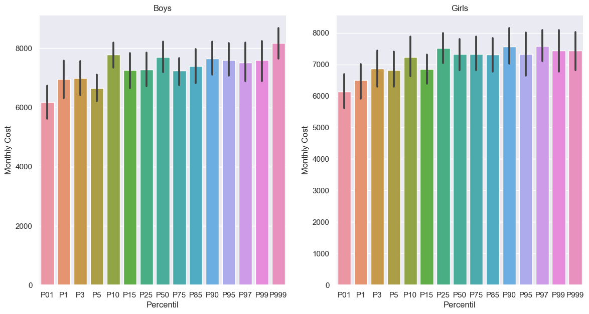
    


```python
fig, ax = plt.subplots(1,2, figsize=(14, 7))

b = sns.boxplot(data=nbp, ax=ax[0])
b.set_xlabel("Percentil")
b.set_ylabel("Monthly Cost")
b.set_title("Boys")

g = sns.boxplot(data=ngp, ax=ax[1])
g.set_xlabel("Percentil")
g.set_ylabel("Monthly Cost")
g.set_title("Girls")
```


    Text(0.5, 1.0, 'Girls')


    
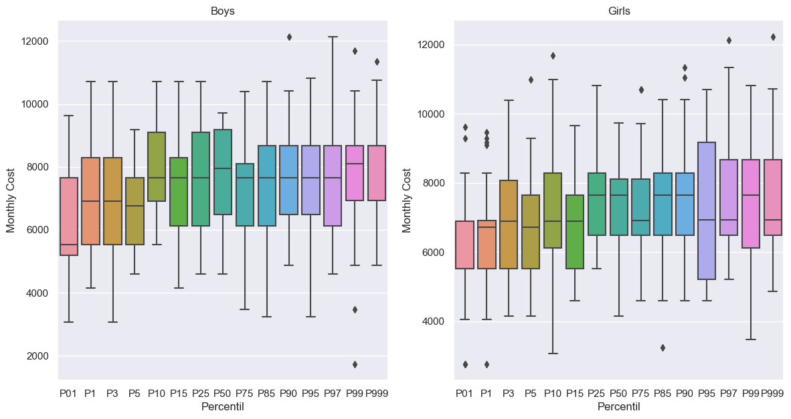
    


```python
b = sns.displot(data=nbp,multiple="stack", kind="kde",)
b.fig.suptitle('Boys')

g = sns.displot(data=ngp,multiple="stack", kind="kde")
g.fig.suptitle('Girls')
```


    Text(0.5, 0.98, 'Girls')


    
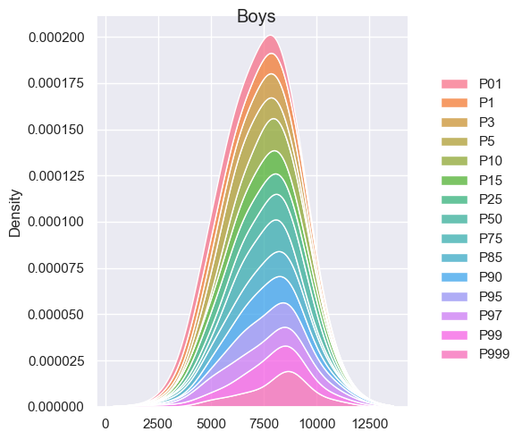
    


    
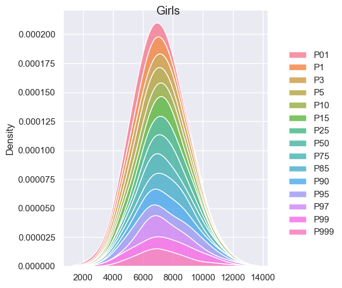
    


```python
keys = [
 'P01',
 'P10',
 'P50',
 'P85',
 'P999'
]
_nbp = nbp[keys]
b = sns.displot(data=_nbp, multiple="stack", kind="kde")
b.fig.suptitle('Boys')

_ngp = ngp[keys]
g = sns.displot(data=_ngp, multiple="stack", kind="kde")
g.fig.suptitle('Girls')
```


    Text(0.5, 0.98, 'Girls')


    
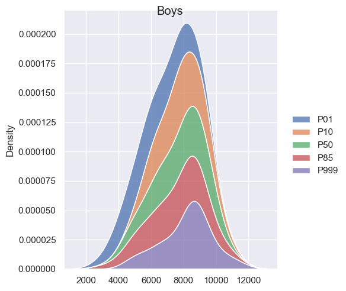
    


    
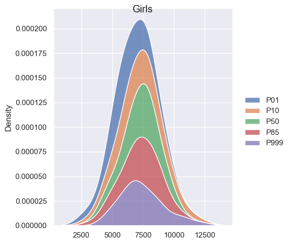
    


#### Conclusiones preliminares:

- Observarmos que hay una tendencia levemente que indica mayor gasto en niños, se debe principalmente a que el niño tiene un peso mayor. 
- Observamos una distinción entre los percentiles para los siguientes percentiles `[ 'P01', 'P10', 'P85', 'P999' ]`  tanto para niños como niñas.
- La cantidad destinada al gasto de pañales no disminuye, por mas que el bebe tienda a utilizar menor cantidad.


#### Comparativa entre marcas

A continuación realizamos el mismo procesamiento pero en lugar de diferencias el presupuesto por genero, armamos el presupuesto mes a mes por marca.


```python
def _filter_series(target_kg, custom_df, month):
    # Calculamos el costo mensual promedio para el percentil en base a *target_kg*
    # Utilizando un consumo mensual fijo de pañales
    _df = custom_df[custom_df['target_kg_min'] <= target_kg]
    _df[target_kg <= _df['target_kg_max']]
    return _df['unit_price'].mean() * _get_random_daily_usage(month) * 30

def _filter_d(target_kg, custom_df):
    return pd.Series([_filter_series(e, custom_df, i) for i, e in enumerate(target_kg)])


def _filter_brand(brand):
    df = prepare_df()
    return df[df['brand'] == brand]

def _prepare_percentils(brand):
    df = _filter_brand(brand)
    keys = [ 'P01', 'P1', 'P3', 'P5', 'P10', 'P15', 'P25', 'P50', 'P75', 'P85', 'P90', 'P95', 'P97', 'P99','P999']
    nbp = bp[keys]
    return nbp.apply(_filter_d, args=(df,))

h_df = _prepare_percentils('huggies')
p_df = _prepare_percentils('pampers')
b_df = _prepare_percentils('babysec')
e_df = _prepare_percentils('estrella')
```


```python
def _add_fig(df, name, ax):
    a = sns.barplot(data=df, ax=ax)
    a.set_title(name, fontweight='bold')
    a.set_ylabel("Monthly Cost")
    a.set_xlabel("Percentil")
    # a.set_ylim(11000)


fig, ax =plt.subplots(1,2, figsize=(14, 7))
_add_fig(h_df, "Huggies", ax=ax[0])
_add_fig(p_df, "Pampers", ax=ax[1])
```


    
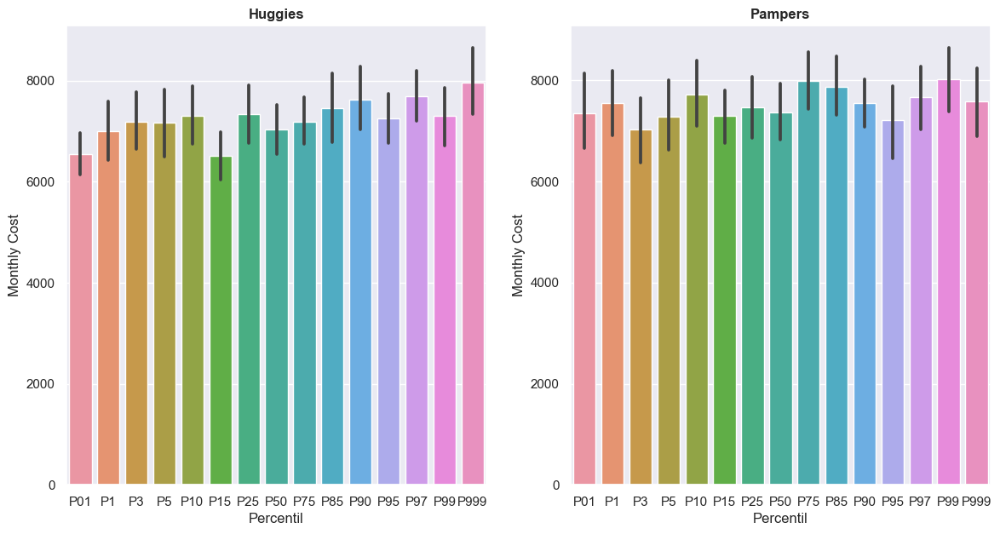
    


```python
def _add_fig(df, name, ax):
    a = sns.boxplot(data=df, ax=ax)
    a.set_title(name, fontweight='bold')
    a.set_ylabel("Monthly Cost")
    a.set_xlabel("Percentil")


fig, ax =plt.subplots(1,2, figsize=(14, 7))
_add_fig(h_df, "Huggies", ax=ax[0])
_add_fig(p_df, "Pampers", ax=ax[1])
```


    
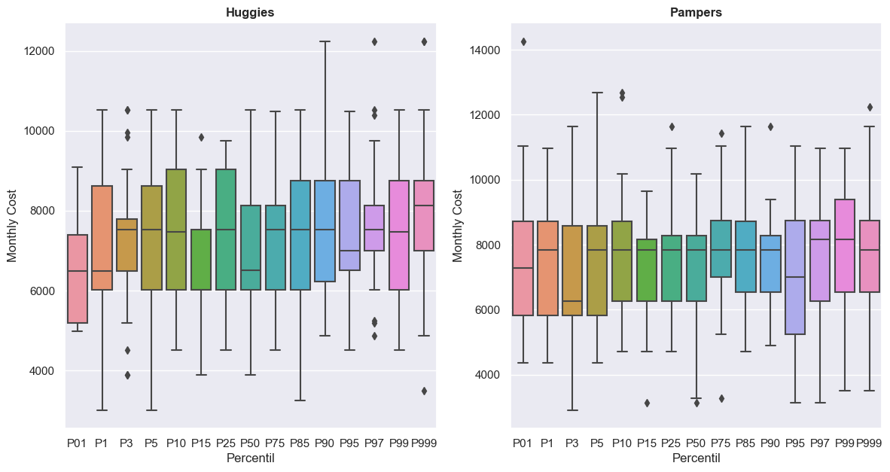
    


```python
def _add_fig(df, name):
    b = sns.displot(data=df, multiple="stack", kind="kde")
    b.fig.suptitle(name)

_add_fig(h_df, "Huggies")
_add_fig(p_df, "Pampers")
```


    
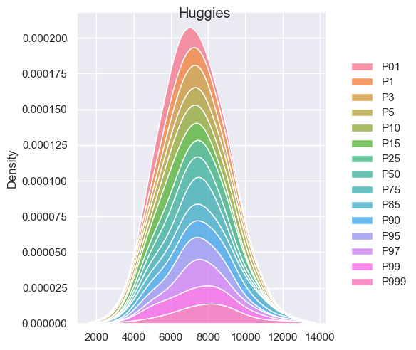
    


    
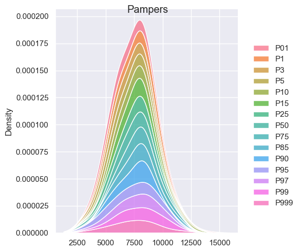
    


#### Conclusiones preliminares:

- Pampers (49%) y Huggies (43.6%) son las marcas predominantes abarcando el ~92.6% de la muestra. Para el caso deBabysec y Estrella no podemos garantizar que sean numeros representativos porque no llegan al 10% de la muestra de items.
- Pampers es mas caro que Huggies para talles de pequeños (rn, p, m) que corresponden a los percentiles P01 a P15.
- 
